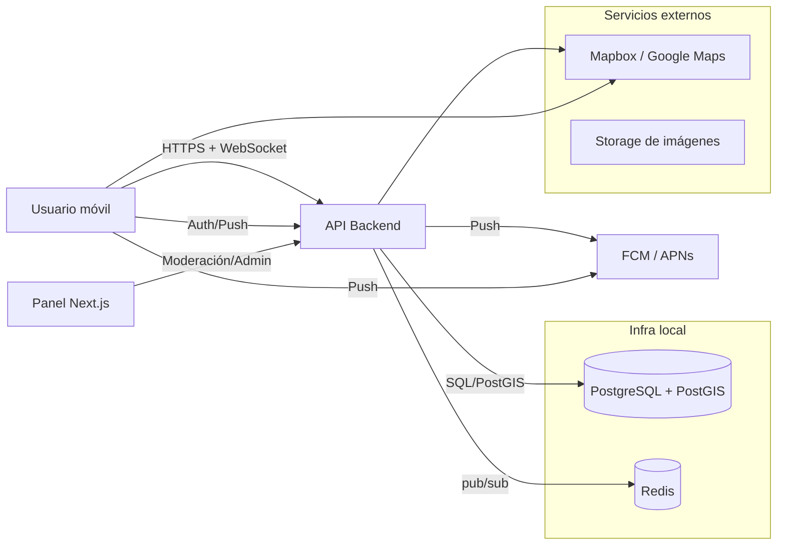

# Arquitectura técnica (local + Ubuntu)

## Componentes

### 1) apps/mobile (Expo)
- Descubre y lista planes por geolocalización
- Crea plan en flujo corto
- WebSocket para chat y cambios de estado

### 2) apps/admin (Next.js)
- Gestión de reportes
- Moderación de usuarios/planes
- Métricas básicas (planes creados, tasa de asistencia)

### 3) Backend/API
- Gestiona autenticación, planes, participantes, chat, reviews y notificaciones
- Emite eventos de dominio para notificaciones y websockets:
  - PLAN_CREATED
  - USER_JOINED_PLAN
  - PLAN_STARTING_SOON
  - PLAN_CANCELLED
  - REVIEW_SUBMITTED

### 4) BD PostGIS
- `plans.location` guarda punto geográfico
- Índice espacial para búsquedas por proximidad
- Estado de plan y participación por enums

## Estrategia de evolución

- Fase 1: local + MVP mínimo con los endpoints básicos
- Fase 2: observabilidad (logs, métricas, sentry, tracing)
- Fase 3: migración a nube con replicas y despliegue de API + workers

